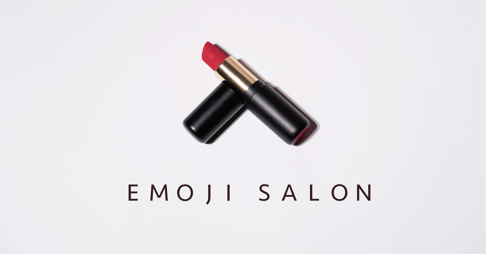

# Emoji Salon - Coloring Your Emoji



**Emoji Salon** is a project that allows you to customize the colors of emojis, just like dressing them up by various cosmetics or coloring them by different paints.

## Emoji Series

- [Noto Color Emoji / Google Font](https://fonts.google.com/noto/specimen/Noto+Color+Emoji)
- [Twemoji-colr / Twitter & Mozilla](https://github.com/mozilla/twemoji-colr)


## Support Browser

- Have been tested:

| | Format | Chrome | Edge | FireFox | Brave | Safari | 
| ---:|:---:|:----:|:----:|:----:|:----:|:----:|
|Twemoji|COLR/CPAL v0| ✅ | ✅ | ✅ | ✅ | ✅ |
|Noto Color Emoji|COLR/CPAL v1| ✅ | ✅ | ✅ | ✅ | ❌ |

| | Format |Chrome on iOS | Safari on iOS | Chrome on Android |
| ---:|:---:|:----:|:----:|:----:|
|Twemoji|COLR/CPAL v0| ✅ | ✅ | ✅ |
|Noto Color Emoji|COLR/CPAL v1| ❌ | ❌ | ✅ |

- You can use [ChromaCheck](https://pixelambacht.nl/chromacheck/) to see whether your browser support COLR/CPAL v0 and COLR/CPAL v1 format.

### COLR/CPAL v0 - Twemoji

- [COLR/CPAL(v0) Font Formats - Can I USe...](https://caniuse.com/colr)
- Basically all browsers and platforms are all supported.


### COLR/CPAL v1 - Noto Color Emoji

- [COLR/CPAL(v1) Font Formats - Can I USe...](https://caniuse.com/colr-v1)
- Technically Supported:
  - Chrome 98+
  - Edge 98+
  - FireFox 107+
  - Opera 86+
  - other Chromium-Based browsers...
- Unsupported:
  - Safari
  - Browsers on iOS/iPadOS devices - they are all based on WebKit kernel


## Packages / Related Dependencies

- [Node.js](https://nodejs.org/)
- [FontKit](https://github.com/foliojs/fontkit)
- [Emoji Mart](https://github.com/missive/emoji-mart)
- [parcel](https://parceljs.org/)
- [ChromaCheck](https://github.com/RoelN/ChromaCheck)

## Build

```
# develop on local machine
npm install
npm start

# build a single html page
# if failed, delete public and .parcel-cache folder and retry
npm run build
```

## How it works?

`COLR` (Color) and `CPAL` (Color Palette) are OpenType technologies introduced by Microsoft to enable the use of multi-colored glyphs and emoji in fonts. These technologies are used to create fonts that contain multiple layers of color information, allowing for complex and vibrant color rendering. User can change the layer's color by override `@font-palette-values` attribute.

For example:

```
@font-palette-values --overridePalette {
  font-family: "Noto Color Emoji";
  base-palette: 0;
  override-colors:
    0 #00ffbb,
    1 #007744;
}

.class {
  font-palette: --overridePalette;
}
```

`COLR/CPAL v1` is an extended version of `COLR/CPAL v0`, designed to elevate the capabilities of color fonts, particularly in the realm of gradient colors.

Currently, most modern web browsers support `COLR/CPAL v0` font format, however, WebKit, the engine behind Safari and all browsers (including third-party) on iPhone and iPad, does not provide full support for `COLR/CPAL v1` fonts. 


## See More...

- [COLRv1 Color Gradient Vector Fonts in Chrome 98 - Chrome for Developers Blog](https://developer.chrome.com/blog/colrv1-fonts/)
- [OpenType COLR (Color Table) Spec - Microsoft](https://learn.microsoft.com/en-us/typography/opentype/spec/colr)
- [OpenType CPAL (Color Palette Table) Spec - Microsoft](https://learn.microsoft.com/en-us/typography/opentype/spec/cpal)
- [\[webkit-dev\] Request for Position: COLR v1 Vector Color Fonts](https://lists.webkit.org/pipermail/webkit-dev/2021-May/031839.html)
- [COLR/CPAL(v0) Font Formats - Can I USe...](https://caniuse.com/colr)
- [COLR/CPAL(v1) Font Formats - Can I USe...](https://caniuse.com/colr-v1)
