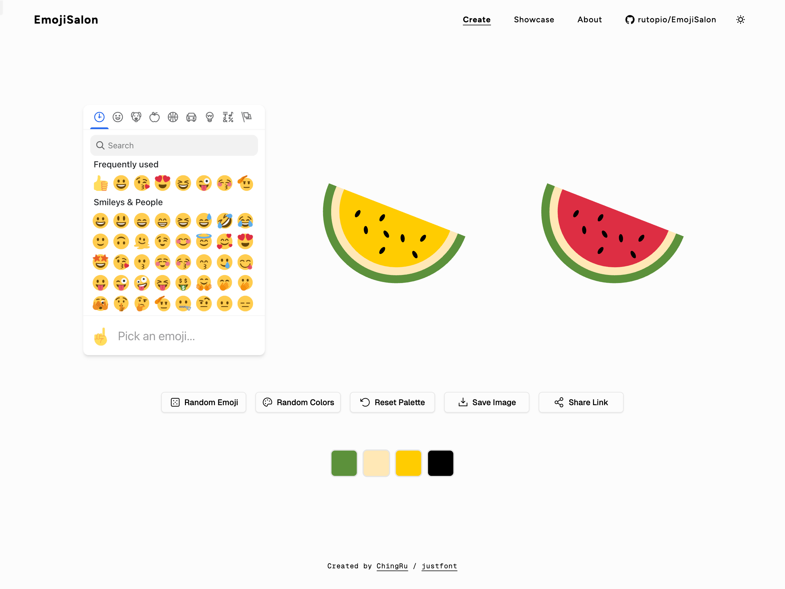
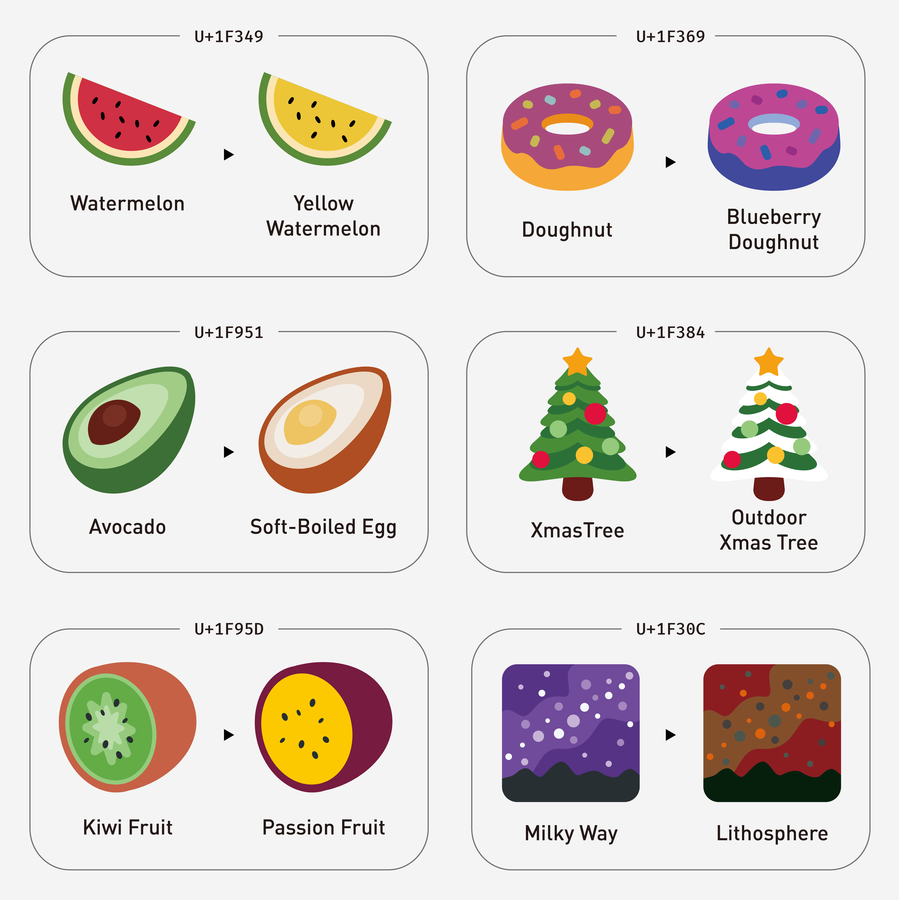
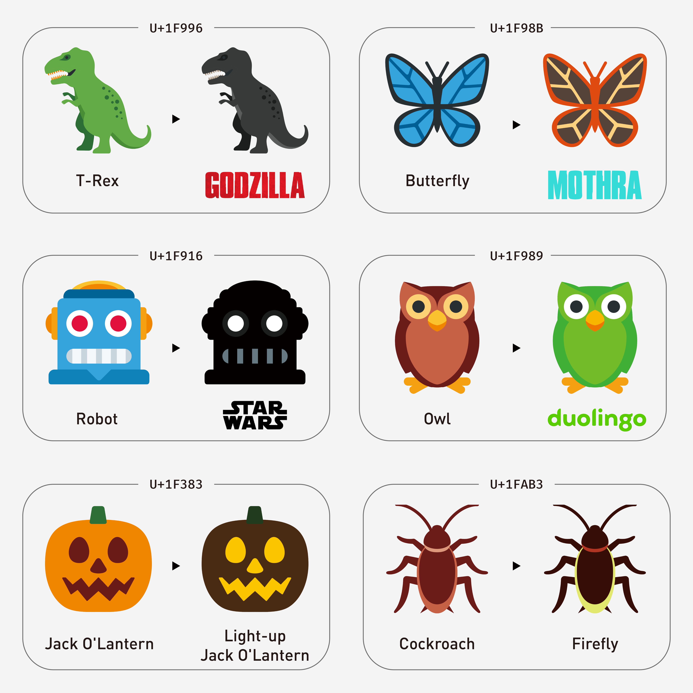
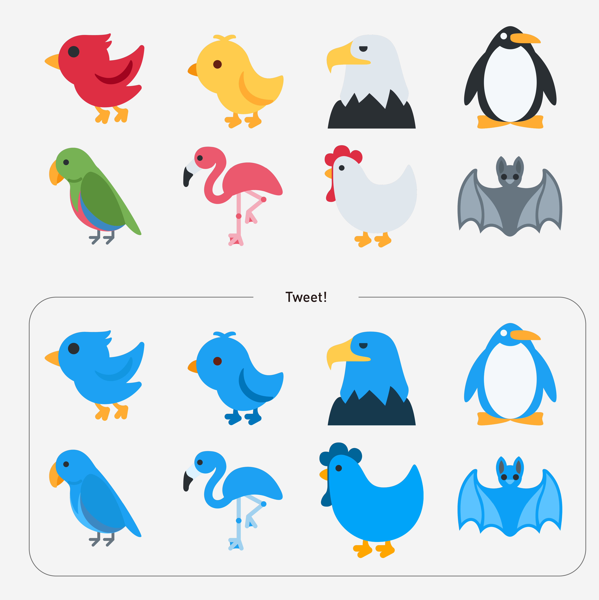
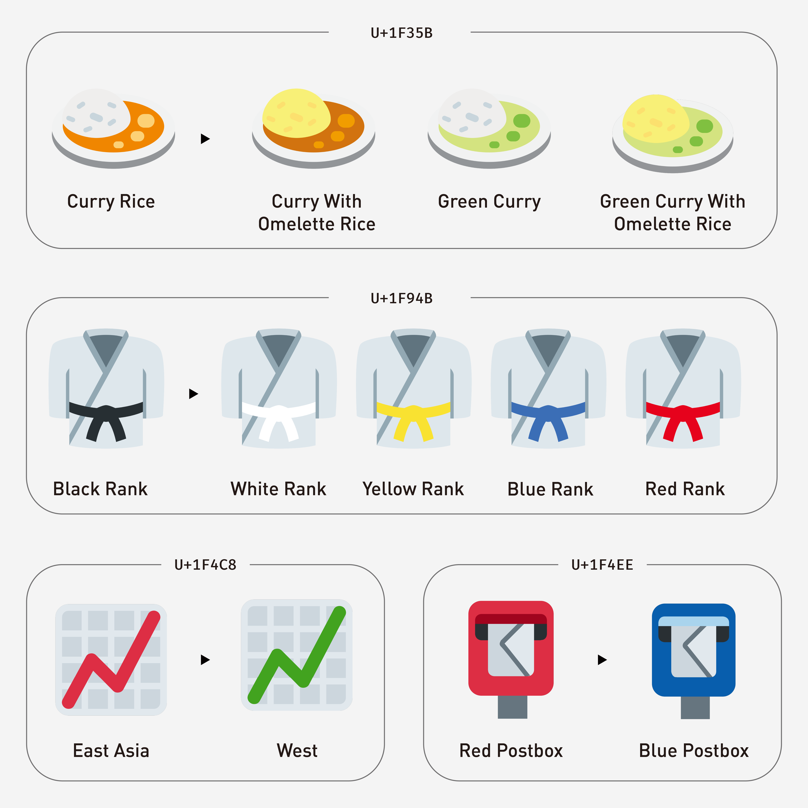

<div align="center">

# EmojiSalon - Coloring Your Emoji

🔗 Playground: [https://emojisalon.pages.dev](https://emojisalon.pages.dev) 🔗


Host on 



**EmojiSalon** allows you to customize the colors of emojis, just like dressing them up with various cosmetics or coloring them with different paints.

</div>

## Introduction

EmojiSalon uses [Twemoji](https://github.com/twitter/twemoji) SVG data for emoji rendering. You can select any emoji, customize its colors, and download your creation as SVG or PNG for personal or commercial use.

## Usage

### Extend Emoji & For Fun

Create unique emoji variations by changing colors to match your style or brand.







### Cross-cultural Design

Adapt emojis for different cultural contexts or create region-specific variations.



### Accessibility

Emoji accessibility is not just a binary between being able to see emoji perfectly and not being able to see them at all — it is a spectrum that accounts for multiple experiences.

#### Challenges for Visually Impaired Users

For people with color vision deficiencies, color blindness, or low vision, identifying certain emojis can be challenging:

- **Similar colors**: Emoji may appear blurry or distorted, making it difficult to distinguish between similar-looking icons
- **Color-based identification**: Many users identify emoji by color or general shape rather than fine details
- **Multiple emoji in sequence**: When several emoji appear in a row, they can be hard to tell apart, especially with similar colors
- **Small keyboard icons**: Emoji keyboards have small icons arranged closely together, making selection difficult

#### Commonly Confused Emoji

**Flag emoji** with similar color schemes are particularly problematic:

- 🇮🇹 Italy vs 🇮🇪 Ireland
- 🇷🇴 Romania vs 🇹🇩 Chad
- 🇱🇻 Latvia vs 🇦🇹 Austria
- 🇲🇨 Monaco vs 🇮🇩 Indonesia

**Heart emoji** colors can also be easily confused:

- ❤️ Red vs 💜 Purple
- 💙 Blue vs 💜 Purple
- 💚 Green vs 🧡 Orange

#### How EmojiSalon Helps

Most current emoji designs do not consider these accessibility needs. EmojiSalon provides a solution by allowing users to:

- Customize emoji colors for better personal distinction
- Create high-contrast variants tailored to individual visual needs
- Generate easily distinguishable emoji for users with specific color vision deficiencies

#### See More

- [Emoji And Low Vision - Veronica With Four Eyes](https://veroniiiica.com/emoji-and-low-vision/)
- [Are you emoji colour blind? - Colour Blind Vision](https://www.facebook.com/ColourBlindVision/posts/are-you-emoji-colour-blinda-strange-concept-to-say-nevertheless-how-many-times-h/678523570194699/)

## Getting Started

1. Clone this repository:

   ```bash
   git clone https://github.com/rutopio/EmojiSalon.git
   cd EmojiSalon
   ```

2. Install dependencies:

   ```bash
   pnpm install
   ```

3. Run the development server:

   ```bash
   pnpm dev
   ```

   The development server should now be running at [http://localhost:3000](http://localhost:3000).

## Building for Production

```bash
pnpm run build
```

Refer to the [TanStack Start hosting docs](https://tanstack.com/start/latest/docs/framework/react/guide/hosting) for deploying to various platforms.

## Data Preprocessing

The emoji SVG data used in this application is preprocessed from [Twemoji](https://github.com/twitter/twemoji) source files. If you need to regenerate or update the emoji data, refer to the [`preprocess/`](./preprocess/) directory.

The preprocessing pipeline includes:

1. **SVG Data Extraction** - Extract path and fill color data from Twemoji SVG files
2. **Category Organization** - Group emojis by category for efficient loading
3. **Palette Extraction** - Extract color palette from Twemoji COLR font
4. **Palette Index Mapping** - Map each emoji layer to palette color indices

See [`preprocess/README.md`](./preprocess/README.md) for detailed instructions on running the preprocessing scripts.

## Copyright

### Graphics

<div align="center">

</div>

Your creation is based on [Twemoji](https://github.com/twitter/twemoji), licensed under [CC-BY 4.0](https://creativecommons.org/licenses/by/4.0/) (graphic).

This license enables reusers to distribute, remix, adapt, and build upon the material in any medium or format, so long as attribution is given to the creator. The license allows for commercial use.

The author does not own any copyright to your work.

### Code

Code licensed under the MIT License: http://opensource.org/licenses/MIT

## Special Thanks

- [justfont](https://justfont.com/)
